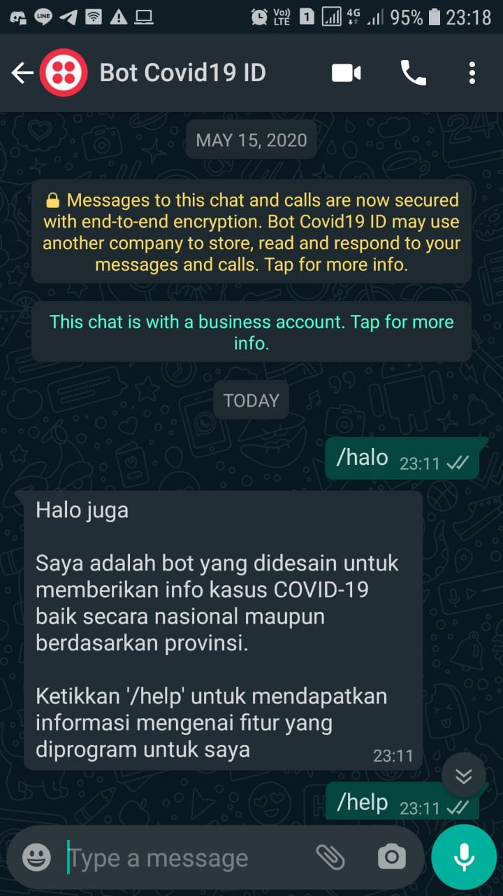
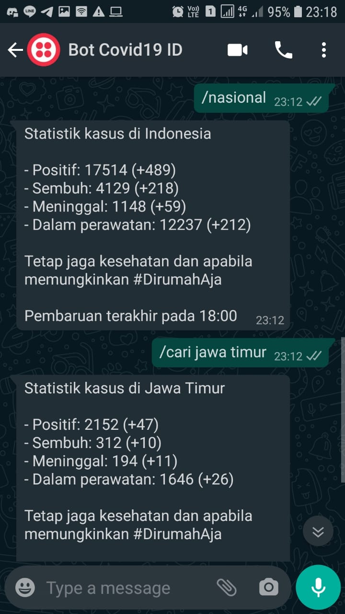

# WhatsApp Bot Covid19

Chatbot WhatsApp untuk mengambil statistik kasus positif Covid19 di Indonesia.

Bot WhatsApp ini menggunakan layanan dari twilio, lalu kemudian dihubungkan ke alamat url file yang bertindak sebagai backend. Turtorial bot WhatsApp & Twilio bisa ditemukan di [sini](https://www.youtube.com/playlist?list=PLyb_C2HpOQSBSm9nGrqSYb_y7VqDrMKJu)

Silahkan lihat di [sini](job) jika ingin menggunakan cron job buat ngambil data secara berkala.

> File database ada di /assets/sql_dump/whatsapp_bot_covid.sql

## Screenshot

  

  

